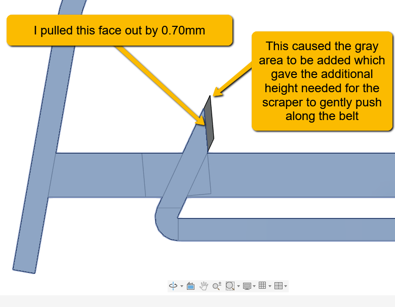
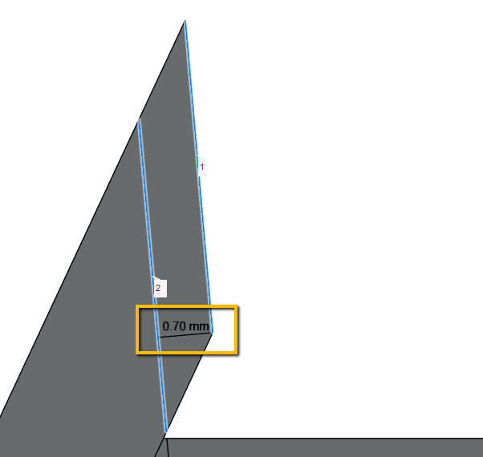
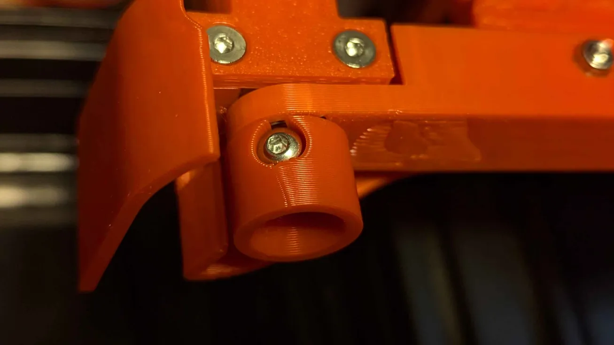

# Mods by Sakitume

This folder contains a few modifications I created when experimenting with Goose Belt Purger from Graylag.

I'm sharing here in case it may be useful to others who are also wishing to adapt the Goose Belt Purger to their custom builds.

--Sakitume (Sock it to me)

## `TPU_Belt` folder

This folder contains:

* `TPU_Belt.stl` - An `.stl` file of the TPU belt
* `TPU_Belt.f3d` - Fusion360 file for the TPU belt.
* `Deflector_short_thin_belt.stl` - A modified "Deflector_short" part. Adjust orientation when printing this part

### Why a printed belt?
I think the original design is excellent. The silicone wristband as a belt works very well. However in my particular case I was experiencing a fair amount of static electricity being generated causing purge strips to stick to the mechanism or even leap across to cling onto my printer frame. I believe it may be due to the properties of the silicon as it rubs against the plastic.

So I thought about trying a belt printed out of TPU. It seems to be working very well for me so far. But keep in mind I've done very limited testing of only a few hundred purges (large volume purges of 5 or 6 strips). Plus I've only tested with PLA filament.

PLA purges do not stick/bond to TPU and seem to lay down well and also remove fairly easily from the TPU belt. I actually park my toolhead over the idler pulley during the filament swap. With my Basic4 filament switcher system it takes maybe 21 seconds from park to filament change to purge. So the nozzle isn't over the belt for very long before things start moving. Also the nozzle is about a millimeter or so above the belt. I am not noticing any degradation to the belt due to heat exposure. At least not yet. My PLA testing is at 220c. If you print at higher temps (like 260 for PETG, ABS, ASA etc) then its possible the TPU belt might be affected. I'd be interested in doing more tests or hearing about your experiences.

### Belt can be customized
Feel free to use the `.f3d` file to adjust the belt to your needs. There are several user defined parameters you can tweak. I've found that an 8mm wide belt to be more flexible than the 12mm width of the original wristband. Also a 1.8mm thickness of the belt worked out well for me. These values as well as the belt diameter can be adjusted.

### `Deflector_short_thin_belt.stl`

This is a modified version of the "Deflector short" part. 

Because the TPU belt is much thinner than the silicone wristband the scraper portion of the "Deflector_short" part no longer touches the belt (there's a gap that is less than a millimeter). I used the CAD files provided by Graylag and "pulled" the face shown in this picture to extend the scraper so it would gently touch the much thinner TPU belt. I pulled it about 0.70mm. There are many variants of this "Deflector" part provided by Graylag so thought it would be best to describe the changes to the "Deflector" part I made and share the `.stl` of the version I ended up using. 

If you use the default "Deflector" part or another variant you can reproduce the changes I describe. *Or* better yet, see if you even really need the scraper to touch the belt. Maybe you can just use any of the original parts as they are. One less thing to do!

## `MotorPulley` folder

This folder contains:

* `GBP_Motor_Pulley_4mmBHCS.stl` - An `.stl` file of the modified motor pulley I use
* `GBP_Motor_Pulley_4mmBHCS.stl.f3d` - Fusion360 file for the modified pulley

The original motor pulley uses a setscrew to help clamp the pulley onto the N20 motor shaft. I had trouble finding a suitable setscrew in my parts stash. But I did have several 4mm length M3 button head screws. So I modified the pulley to work with this type of screw and it seems to work pretty well. Don't overtighten!

